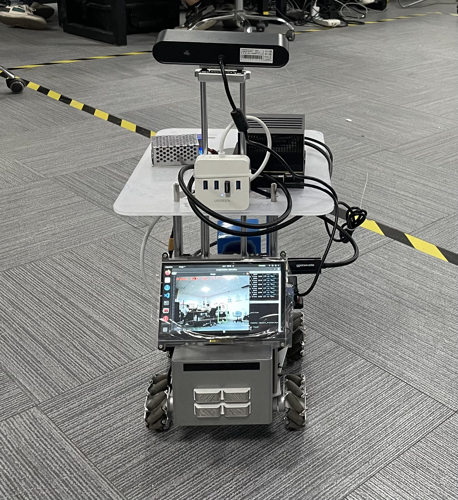
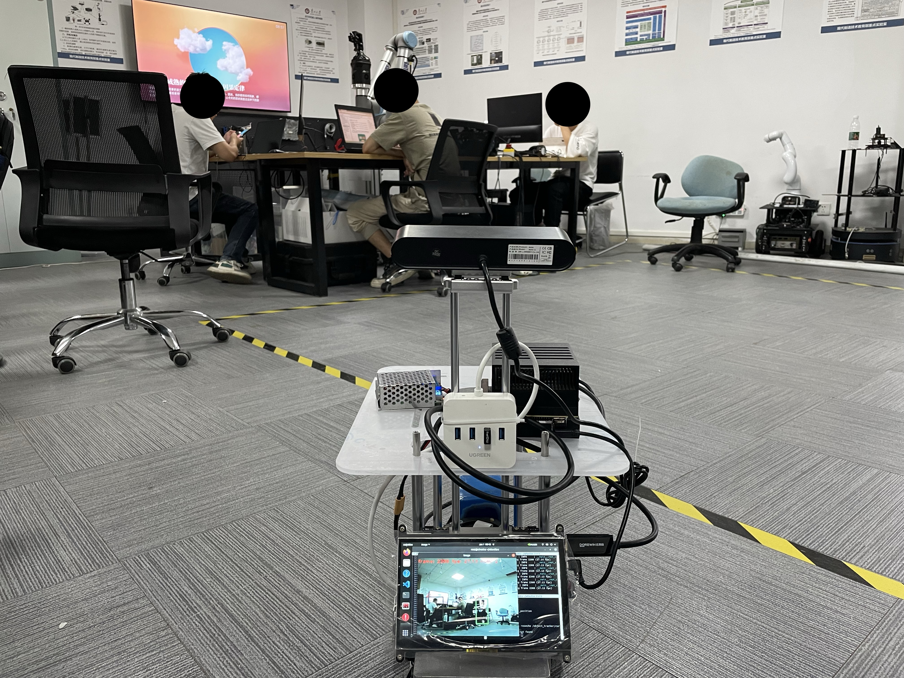
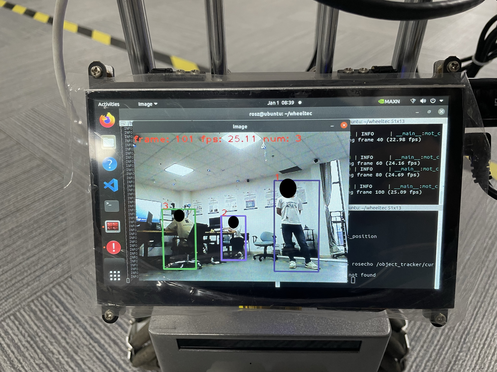

# TrackBot
This is an ROS package for a mobile robot that implements visual multi-target tracking. The currently implemented functionality allows the robot to follow a selected person within its field of view. This function was developed based on the Wheeltec robot, so we are only open-source the multi-target tracking feature.

  

## Jetson
To address the limited onboard computing power of the mobile robot, we have offloaded the visual processing tasks to an NVIDIA Jetson platform. The multi-object tracking algorithm running on the Jetson achieves a processing speed of around 25 FPS. We have configured the robot’s movement system as the ROS master and the Jetson’s visual computation system as the ROS slave. Through ROS’s distributed communication framework, the selected target’s coordinates are transmitted via Wi-Fi to the ROS master, ultimately enabling multi-target tracking functionality.

  

## Display
You can select any person on the screen to follow.

  
  

